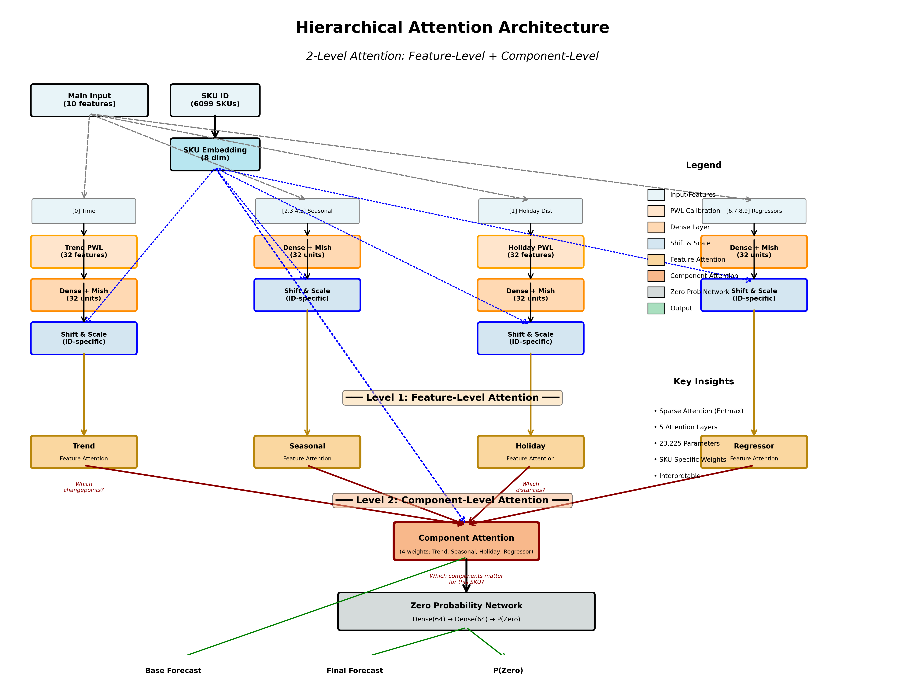

# Hierarchical Attention Architecture

This directory contains the hierarchical attention architecture for intermittent demand forecasting.

## Architecture Overview

The hierarchical attention mechanism operates at two levels:

### Level 1: Feature-Level Attention
Applied to component outputs to select which features matter within each component:

- **Trend Component**: Attention on PWL-calibrated changepoint features
  - Learns which time regions (changepoints) are important for each SKU
  - Example: "SKU uses changepoints 1, 5, 8 for early growth phase"
  
- **Seasonal Component**: Attention on Dense layer outputs
  - Learns which seasonal pattern features matter for each SKU
  - Example: "SKU uses weekly and monthly patterns, ignores quarterly"

- **Holiday Component**: Attention on PWL-calibrated distance features
  - Learns which distances from holidays matter for each SKU
  - Example: "SKU sensitive only 7-14 days before Christmas"
  
- **Regressor Component**: Attention on Dense layer outputs
  - Learns which regressor features are important for each SKU
  - Example: "SKU responds to price changes but not promotions"

### Level 2: Component-Level Attention
- Attention across all components (trend/seasonal/holiday/regressor)
- Learns the importance of each component for different SKUs
- Example: "Trend=60%, Seasonal=30%, Holiday=10%, Regressor=0%"

## Key Features

- **Two-Level Hierarchy**: Feature-level (which features within component) + Component-level (which components)
- **Sparse Attention**: Uses sparsemax activation (TensorFlow-native) that can output exact zeros
- **PWL Calibration**: Piecewise linear calibration for trend and holiday components
- **SKU-Specific**: All attention is conditioned on SKU embeddings
- **Interpretable**: Can analyze attention weights at both levels to understand model decisions
- **Efficient**: Lightweight architecture with minimal parameters

## Files

- `components.py`: Component builders with hierarchical attention
  - `Entmax15`: TensorFlow sparsemax implementation
  - `TrendComponentBuilder`: Trend with PWL and attention
  - `SeasonalComponentBuilder`: Seasonal patterns
  - `HolidayComponentBuilder`: Holiday effects with PWL and attention
  - `RegressorComponentBuilder`: Additional regressors
  - `HierarchicalAttentionIntermittentHandler`: Multi-level attention for zero probability
  - `DeepSequencePWLHierarchical`: Main model class

- `model.py`: High-level model creation and training utilities
  - `create_hierarchical_model()`: Model factory function
  - `compile_hierarchical_model()`: Compilation with appropriate losses
  - `get_training_callbacks()`: Standard callbacks for training

- `__init__.py`: Package exports

## Usage Example

```python
from deepsequence_pwl.hierarchical_attention import create_hierarchical_model, compile_hierarchical_model

# Create model
main_model, trend_model, seasonal_model, holiday_model, regressor_model = create_hierarchical_model(
    num_skus=6099,
    n_features=10,
    component_hidden_units=32,
    trend_feature_indices=[0],
    seasonal_feature_indices=[2, 3, 4, 5],
    holiday_feature_index=1,
    regressor_feature_indices=[6, 7, 8, 9],
    time_min=0.0,
    time_max=365.0
)

# Compile
model = compile_hierarchical_model(main_model, learning_rate=0.005)

# Train
model.fit(
    [X_train, sku_ids_train],
    {
        'base_forecast': y_train,
        'final_forecast': y_train,
        'zero_probability': is_zero_train
    },
    validation_data=(...),
    epochs=100,
    callbacks=get_training_callbacks('best_model.h5')
)
```

## Benefits for Intermittent Demand

1. **Sparsity**: Can completely ignore irrelevant features/components
2. **Adaptability**: Different SKUs use different patterns
3. **Interpretability**: Analyze attention weights to understand predictions
4. **Efficiency**: Hierarchical structure reduces parameters while increasing capacity
5. **Robustness**: Multiple levels of attention provide redundancy

## Architecture Visualization



The diagram above shows the complete 2-level hierarchical attention architecture:

1. **Input Layer**: Main features (10) and SKU embeddings (8 dimensions)
2. **Component Branches**: Four parallel branches for Trend, Seasonal, Holiday, and Regressor
   - Trend and Holiday use PWL calibration for non-linear transformations
   - All components use Dense layers with Mish activation
   - Shift-and-scale applied using SKU embeddings for personalization
3. **Level 1 - Feature Attention**: Each component gets feature-level attention (4 layers)
4. **Level 2 - Component Attention**: Attention across all components (1 layer)
5. **Zero Probability Network**: Two-layer Dense network for intermittent handling
6. **Outputs**: Base forecast, final forecast, and zero probability

**Key Metrics**:
- Total Parameters: 23,225
- Attention Layers: 5 (4 feature-level + 1 component-level)
- Sparse Attention: Entmax15 (sparsemax) for exact zeros

To regenerate the architecture diagram:
```bash
python visualize_hierarchical_architecture.py
```

## Testing

Run `test_hierarchical_attention.py` in the project root to verify the architecture:

```bash
python test_hierarchical_attention.py
```

This tests:
- Model building
- Forward pass
- Training step
- Attention layer verification
- PWL calibration integration
